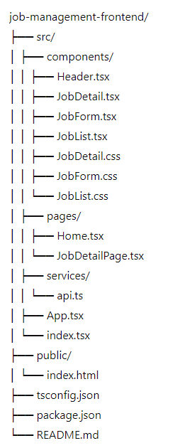

# Job Management Frontend

## Overview

The Job Management Frontend is built with React and TypeScript, providing a user-friendly interface to interact with the Job Management Backend. It allows users to view, add, edit, and delete job records, ensuring date formats are consistent with the backend requirements.

## Project Structure




## Setup Instructions

1. **Clone the repository**:
    ```bash
    git clone <repository-url>
    cd job-management-frontend
    ```

2. **Install dependencies**:
    ```bash
    npm install
    ```

3. **Run the frontend development server**:
    ```bash
    npm start
    ```

## Application Features

- **Job List View**: Displays all jobs in a list format.
- **Job Details View**: Displays detailed information about a specific job.
- **Add Job Form**: Allows users to add new job records.
- **Edit Job Form**: Allows users to edit existing job records.
- **Delete Job**: Allows users to delete job records.

## Components

- **Header**: Displays the application log and the top bar.
- **JobList**: Lists all job records with options to edit and delete.
- **JobDetail**: Displays detailed information about a selected job.
- **JobForm**: Used for both adding new jobs and editing existing jobs.

## Styling

CSS is used for styling components, ensuring a consistent and responsive design. Flexbox is used for layout and alignment of buttons and form elements.

## Handling Dates

Dates are handled using the `datetime-local` input type in forms. Dates are formatted to match the backend's requirements before being sent in API requests.
